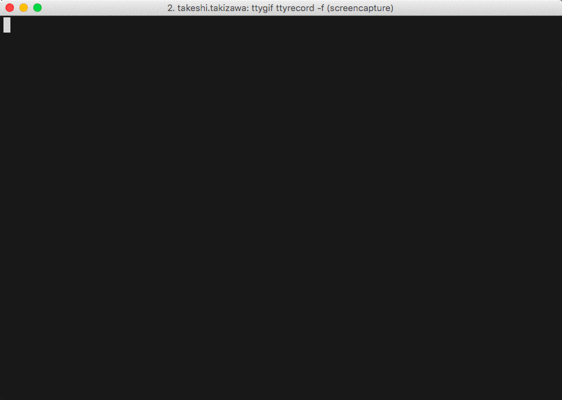
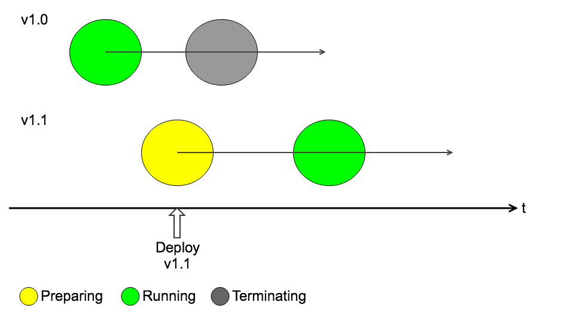
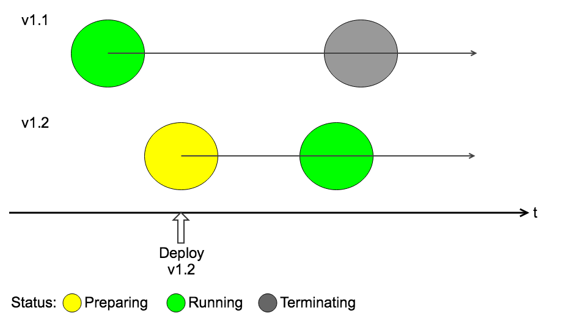
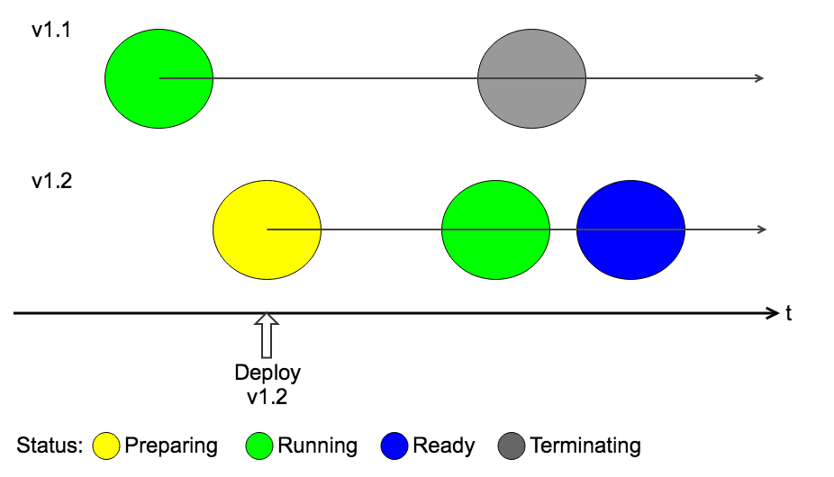
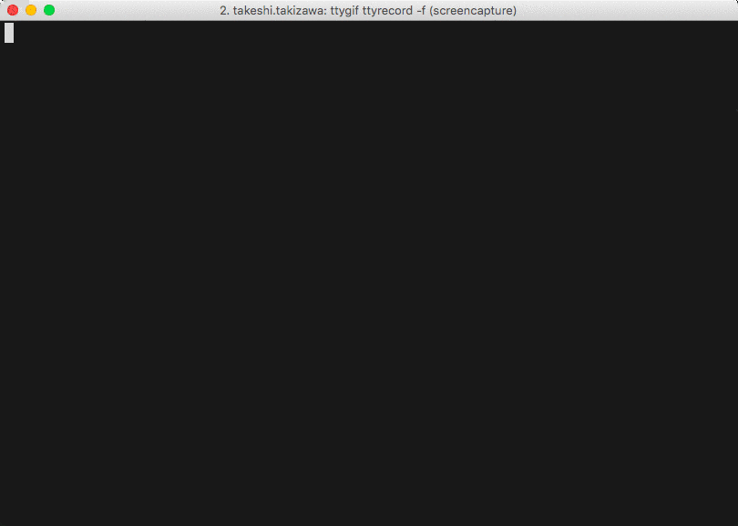
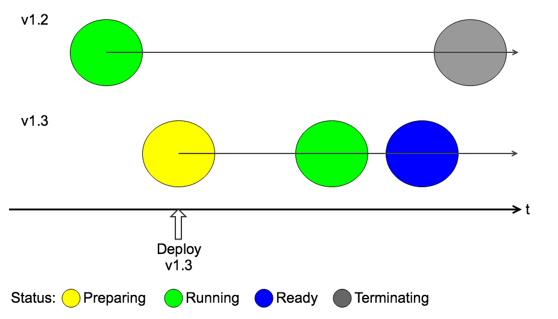

Kubernetes rolling update safely
================================

This file is generated from *README.md.tmpl* using [readme](https://github.com/TakiTake/readme).

## Demo environment

```
minikube version: v0.28.2
```

## Preparations

```shell
# start minikube
$ minikube start

# change docker host to minikube
# then, you can use own docker image from kubernetes without uploading it to some registry
$ eval $(minikube docker-env)

# build demo application
$ docker build -t takitake/demo demo
```

## Demo scenarios

### Default setting

Deploy simple spring-boot application.

```
$ cat demo-manifest/1-0.default.deploy.yml
apiVersion: extensions/v1beta1
kind: Deployment
metadata:
  labels:
    app: demo
  name: demo
spec:
  replicas: 1
  selector:
    matchLabels:
      app: demo
  template:
    metadata:
      labels:
        app: demo
      annotations:
        appVersion: v1.0
    spec:
      containers:
      - image: takitake/demo
        imagePullPolicy: IfNotPresent # Don't pull container image everytime
        name: demo
        env:
        - name: POD_NAME # Passing Pod name as a environment varible
          valueFrom:
            fieldRef:
              fieldPath: metadata.name
```

Deploy and watch Pod status. You can see the state transition *ContainerCreating* to *Running*.

```sh
$ kubectl apply -f demo-manifest/1-0.default.deploy.yml && kubectl get pods -w
deployment.extensions "demo" created
NAME                    READY     STATUS              RESTARTS   AGE
demo-67fb9964f4-xmrwj   0/1       ContainerCreating   0          0s
demo-67fb9964f4-xmrwj   1/1       Running   0         1s
```

Let's create the Service to access the deployed demo application.

```sh
$ kubectl apply -f demo-manifest/service.yml
service "demo" created

$ kubectl get service demo
NAME      TYPE       CLUSTER-IP       EXTERNAL-IP   PORT(S)          AGE
demo      NodePort   10.111.204.139   <none>        8080:32569/TCP   23s

$ minikube status
minikube: Running
cluster: Running
kubectl: Correctly Configured: pointing to minikube-vm at 192.168.99.100
```

Now you can access the demo application through the Kubernetes Service. IP should be the minikube nodeIP and Port should be the NodePort of the demo Service.

This case URL is [http://192.168.99.100:32569/](http://192.168.99.100:32569/). Or you only have to execute `minikube service demo` then the URL is opened.

Next, in order to check the rolling update, try changing the appVersion from v1.0 to v1.1

```sh
$ diff "demo-manifest/1-0.default.deploy.yml" "demo-manifest/1-1.default.deploy.yml"
17c17
<         appVersion: v1.0
---
>         appVersion: v1.1
```

```sh
# If you want to check http status also. Following command is usuful to check the status every 1 sec.
$ export DEMO_URL=$(minikube service demo --url)
$ while do curl -s -w " -- `date` -- %{http_code}\n" $DEMO_URL; sleep 1s; done
```

```sh
$ kubectl apply -f demo-manifest/1-1.default.deploy.yml && kubectl get pods -w
deployment "demo" configured
NAME                    READY     STATUS              RESTARTS   AGE
demo-7fb4df47ff-zphkn   0/1       ContainerCreating   0          1s
demo-7ff7477c9b-jf26z   1/1       Terminating         0          1m
demo-7fb4df47ff-zphkn   1/1       Running   0         1s
demo-7ff7477c9b-jf26z   0/1       Terminating   0         1m
demo-7ff7477c9b-jf26z   0/1       Terminating   0         1m
demo-7ff7477c9b-jf26z   0/1       Terminating   0         1m
```



After existing Pod status became `Terminating` , new Pod status became `Running` ..

Because `maxUnavailable` is 1 by default so only one running Pod was terminated soon.

Dividing the Pod's status into three, the status will change as follows.



There are two solusitions that changing the value of maxUnavailable to 0 or increasing number of replicas.
Changing the maxUnavailable to 0 this time to simplify the problem.

### Changing strategy of rolling update

```
$ diff "demo-manifest/1-1.default.deploy.yml" "demo-manifest/1-2.strategy.deploy.yml"
11a12,15
>   strategy:
>     rollingUpdate:
>       maxSurge: 1
>       maxUnavailable: 0
17c21
<         appVersion: v1.1
---
>         appVersion: v1.2
```

```sh
$ kubectl apply -f demo-manifest/1-2.strategy.deploy.yml && kubectl get pods -w
deployment "demo" configured
NAME                    READY     STATUS              RESTARTS   AGE
demo-5b47cd65cd-zg49d   0/1       ContainerCreating   0          0s
demo-7fb4df47ff-hb8xx   1/1       Running             0          13m
demo-5b47cd65cd-zg49d   1/1       Running   0         1s
demo-7fb4df47ff-hb8xx   1/1       Terminating   0         13m
demo-7fb4df47ff-hb8xx   0/1       Terminating   0         13m
demo-7fb4df47ff-hb8xx   0/1       Terminating   0         13m
demo-7fb4df47ff-hb8xx   0/1       Terminating   0         13m
```


hmm, still we can lose user's request. Even though, new Pod status became `Running` before old Pod was terminated.



Because `Ready for Pod` != `Read for Application`. To explain this status I added one more status `Ready` into the timeline.



To fix this issue we need to tell Kubernetes when Application is ready expressly.

### Define ready state of the application

We can configure how to confirm the application is ready or not yet in manifest file. It is called `ReadinessProbe`. This demo application has healcheck endpoint thus it's the most easilest way that calling the endpoint with http GET request. More detail please see https://kubernetes.io/docs/tasks/configure-pod-container/configure-liveness-readiness-probes/ .

```
$ diff "demo-manifest/1-2.strategy.deploy.yml" "demo-manifest/1-3.readinessprobe.deploy.yml"
21c21
<         appVersion: v1.2
---
>         appVersion: v1.3
31a32,35
>         readinessProbe:
>           httpGet:
>             path: /actuator/health
>             port: 8080
```

```sh
$ kubectl apply -f demo-manifest/1-3.readinessprobe.deploy.yml && kubectl get pods -w
deployment "demo" configured
NAME                    READY     STATUS              RESTARTS   AGE
demo-5b47cd65cd-zg49d   1/1       Running             0          6m
demo-c88bcc897-h5dkg    0/1       ContainerCreating   0          1s
demo-c88bcc897-h5dkg   0/1       Running   0         2s
demo-c88bcc897-h5dkg   1/1       Running   0         17s
demo-5b47cd65cd-zg49d   1/1       Terminating   0         7m
demo-5b47cd65cd-zg49d   0/1       Terminating   0         7m
demo-5b47cd65cd-zg49d   0/1       Terminating   0         7m
demo-5b47cd65cd-zg49d   0/1       Terminating   0         7m
```



Finally, we can rolling update safely!


